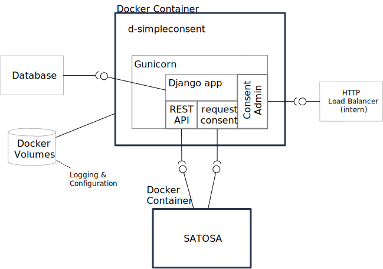
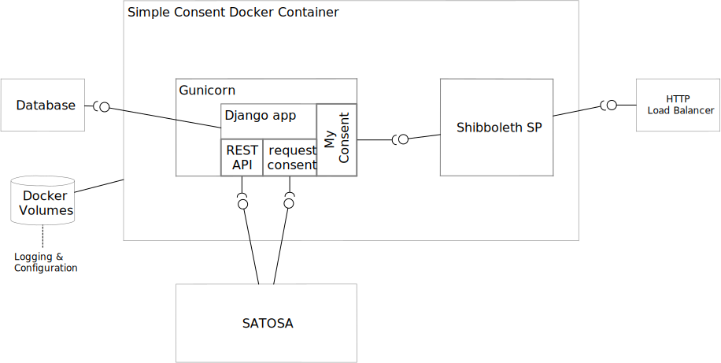

# Simple Consent for Attribute Release

Web Service including GUI to obtain, store and maintain user consent.
The primary purpose is to provide a consent service to SATOSA:

- Consent is all or nothing (no attribute selection)
- Can store consent to release attributes for relying parties
- No grouping of related relying parties, consent is always specific to an entity
- Plug & play integration for SATOSA
- "Manage my consent" is an WebSSO-authenticated application allowing the user to revoke and review current and revoked consent.
  It has an admin function to search and review consent records of all users.

.flow "happy path"

## Structure

.Components

.Provided interfaces
1. A REST API call that will decide if a user at a particular party has a valid consent.
2. A redirect endpoint to request a new consent from the user using a web GUI
3. A WebSSO-protected app to manage existing consent

.Required interfaces
1. Database to store consent
2. Docker volumes
    ** Gunicorn + Shibboleth logging
    ** Gunicorn, Shibboleth + Django configuration

## Persistence

Using the standard Django ORM a number of database backends are supported.

## Deployment

The recommended deployment uses the docker image provided in the github repo d-simpleconsent.
The single image containers both the django app and the Shibboleth SP.

## Access control and security considerations

* The API endpoint relies on network protection. 
  Therefore access must be restricted to SATOSA.
* The redirect endpoint is protected against XSS using a CSRF cookie.
* The "Manage my consent" service is registered as a relying party.
  It is grouped with a Shbboleth SP in the related docker project to require a valid session. 
  It requires an active the userid attribute to link to consent records, too.  